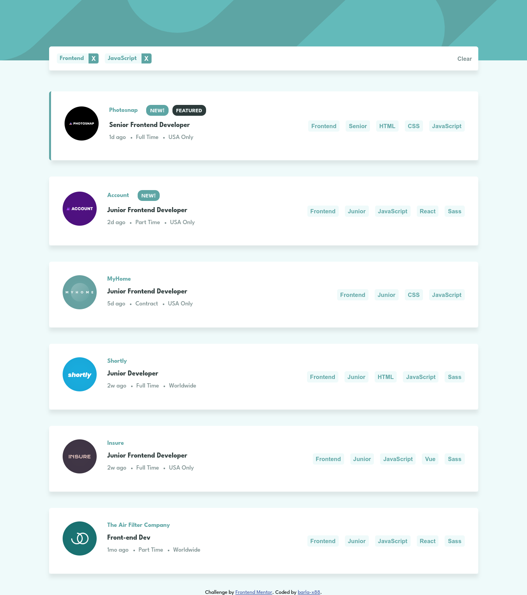

# Frontend Mentor - Job listings with filtering solution

This is a solution to the [Job listings with filtering challenge on Frontend Mentor](https://www.frontendmentor.io/challenges/job-listings-with-filtering-ivstIPCt). Frontend Mentor challenges help you improve your coding skills by building realistic projects.

## Table of contents

- [Overview](#overview)
  - [The challenge](#the-challenge)
  - [Screenshot](#screenshot)
  - [Links](#links)
- [My process](#my-process)
  - [Built with](#built-with)
  - [What I learned](#what-i-learned)
  - [Useful resources](#useful-resources)
- [Author](#author)

## Overview

### The challenge

Users should be able to:

- View the optimal layout for the site depending on their device's screen size
- See hover states for all interactive elements on the page
- Filter job listings based on the categories

### Screenshot

### Links

- Solution URL: [Github Repo](https://github.com/barla-x88/fm-job-listing)
- Live Site URL: [Live Site](https://fm-jobs.netlify.app/)

## My process

### Built with

- Semantic HTML5 markup
- CSS custom properties
- Flexbox
- Mobile-first workflow
- [React](https://reactjs.org/) - JS library

### What I learned

1. Adding multiple backgrounds to the same element
2. Custom styles for HTML checkbox
3. Using psuedo elements for styling elements

### Useful resources

- [Pure CSS Custom Checkbox Style](https://moderncss.dev/pure-css-custom-checkbox-style/) - This helped me to add create custom checkboxes.

## Author

- Website - [Ankit Barla](https://barla-x88.github.io/portfolio/)
- Frontend Mentor - [@barla-x88](https://www.frontendmentor.io/profile/barla-x88)
- Twitter - [@BarlaX88](https://twitter.com/BarlaX88)
